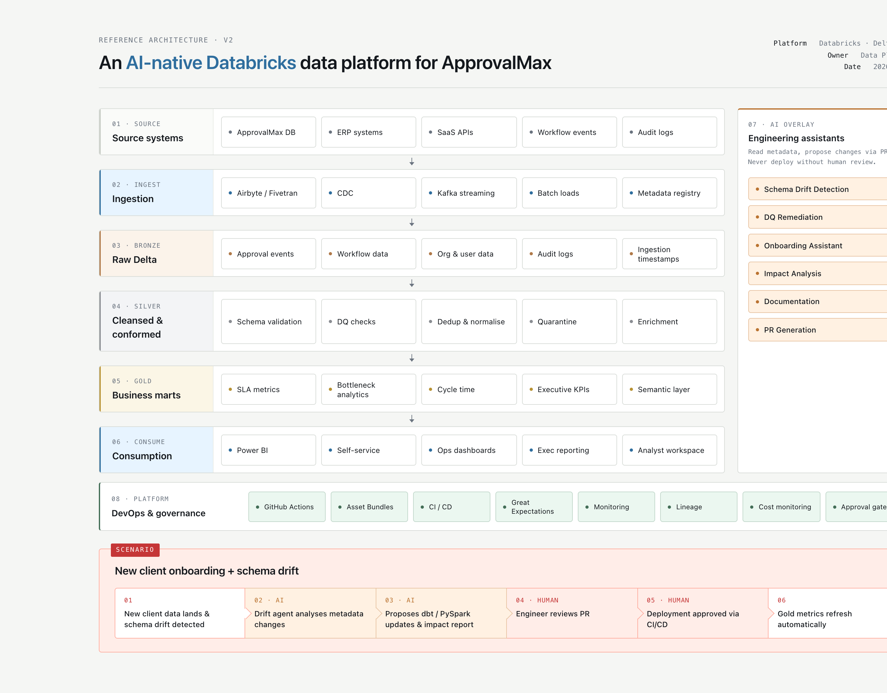
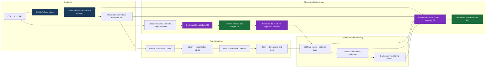

# approvalmax-ai-platform-v2

## Overview

This repository is a Databricks reference implementation for a production-style B2B SaaS data platform. It shows how CDC events can be landed safely, modelled through Bronze, Silver, Vault-style, and Gold layers, validated with dbt and Great Expectations-style checks, monitored through dashboard-ready tables, and extended through AI-assisted pull requests without allowing autonomous changes to business keys, financial metrics, secrets, or quality gates.

## Architecture





| Node type | Colour | Meaning |
| --- | --- | --- |
| AI node | Purple | Codex-generated proposal or recovery artefact |
| Human review | Green | Required approval before promotion or merge |
| GitHub Actions | Dark blue | CI/CD orchestration boundary |

CDC JSONL files are processed by GitHub Actions, deployed as Databricks Asset Bundle resources, and executed through serverless notebook jobs. The data platform lands raw CDC records, derives curated operational models, validates Gold outputs, refreshes monitoring tables, and routes unknown source contexts through reviewable metadata pull requests.

## Design Decisions

Databricks Asset Bundles are used because this scope is application-level data platform automation: jobs, notebooks, resource files, and CI/CD validation. Terraform would be better suited to account-level infrastructure, networking, identity, and cross-workspace policy.

The workspace is serverless-only, so jobs use `notebook_task` resources and avoid `new_cluster`, `job_clusters`, `existing_cluster_id`, and `spark_python_task`. Notebook code also avoids `spark.sparkContext`, keeping the implementation aligned with serverless execution constraints.

AI is limited to proposing changes because the important risks are semantic. Business keys, grains, financial metrics, secrets, and failed quality gates require human review before merge or deployment.

## Components

### Bronze

Bronze stores permissive raw CDC records in `approvalmax_ai_platform.bronze`. It preserves the event envelope, source context, operation, primary key map, timestamps, metadata, and raw payload.

### Silver

Silver stores current-state operational tables in `approvalmax_ai_platform.silver`. It models known CDC contexts into stable tables such as companies, finance documents, approval events, subscriptions, and users.

### Vault

The Vault-style layer stores hubs, links, and satellites in `approvalmax_ai_platform.vault`. It is included to show how identity, relationships, and descriptive history can be separated when source domains expand.

### Gold

Gold stores semantic dimensions and facts in `approvalmax_ai_platform.gold`. These tables support lifecycle analytics, approval event reporting, dbt tests, validation, and dashboard consumption.

### dbt

dbt owns Gold semantic models and schema tests. Approved CDC contexts can generate conservative dbt model candidates after the metadata registry has been reviewed.

### Monitoring

Monitoring tables live in `approvalmax_ai_platform.monitoring`. They capture ETL audit logs, validation results, layer row counts, pipeline summaries, quality status, and dashboard-ready operational views.

## How to Run

Required GitHub secrets:

```text
DATABRICKS_HOST
DATABRICKS_TOKEN
CODEX_AUTH_JSON
```

Optional:

```text
OPENAI_API_KEY
```

Validate and deploy:

```bash
databricks bundle validate -t dev --profile vim
databricks bundle deploy -t dev --profile vim
```

Run CDC automation:

```bash
databricks bundle run approvalmax_cdc_automation_serverless -t dev --profile vim
```

Run dbt:

```bash
cp profiles.yml.example profiles.yml
dbt deps --profiles-dir .
dbt debug --profiles-dir . --target dev
dbt compile --profiles-dir . --target dev
dbt run --profiles-dir . --target dev --select fact_approval_document_lifecycle_dbt
dbt test --profiles-dir . --target dev --select fact_approval_document_lifecycle_dbt
```

Run Great Expectations-style validation:

```bash
databricks bundle run approvalmax_great_expectations_serverless -t dev --profile vim
```

Refresh dashboard tables:

```bash
databricks bundle run approvalmax_dashboard_refresh_serverless -t dev --profile vim
```

Detect new CDC contexts:

```bash
python scripts/detect_new_cdc_contexts.py
```

The detector reads `sample_data/approvalmax_cdc/*.jsonl`, compares `source_table` values with `metadata/supported_cdc_contexts.yml`, writes `recovery/new_cdc_contexts.json`, and exits with code `10` when new contexts are found.

Detect client integration changes:

```bash
python scripts/detect_client_integration_changes.py
```

Client requests live in `sample_data/client_change_requests/`. The detector compares them with `metadata/client_integrations.yml`, creates reviewable candidate metadata, evaluates request/schema quality, and can generate Databricks dashboard and app candidates for approved Gold and monitoring tables.

GitHub Actions chain:

- `On push/manual: platform bundle and CDC`
- `On success/manual: dbt, GE, dashboard refresh`
- `On data/client change: propose metadata and dashboards`
- `On approved context/manual: generate dbt and GE`
- `On workflow failure: Codex recovery PR`

## AI Safety

AI-assisted recovery is semi self-healing, not autonomous production change.

Rules:

- AI proposes, tests validate, humans approve, CI/CD deploys.
- Do not auto-merge.
- Do not disable tests.
- Do not change or print secrets.
- Do not change business keys without human review.
- Do not redefine financial metrics without human review.
- New CDC contexts require human review before promotion beyond Bronze.

## Known Gaps

- No streaming ingestion. The production equivalent would use Auto Loader, Lakeflow Declarative Pipelines, or structured streaming with checkpointing.
- No Feature Store or MLflow. The current scope is governed analytical modelling and operational recovery, not feature serving or experiment tracking.
- The Vault layer is included for modelling completeness but is premature at three primary source domains. It becomes more valuable once cross-domain historisation and lineage justify the extra modelling surface.
- No Unity Catalog row-level security. The production equivalent would add grants, row filters, column masks, and environment-specific access policies.
